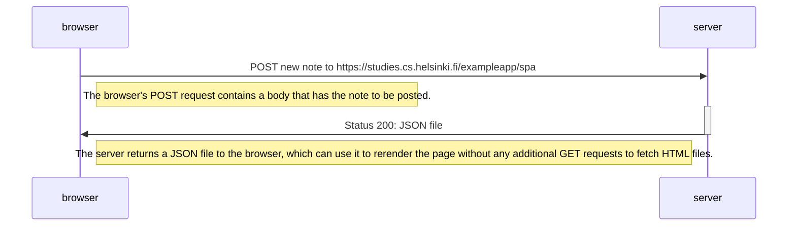

0.6 New note SPA

```mermaid
sequenceDiagram
    participant browser
    participant server

    browser->>server: POST new note to https://studies.cs.helsinki.fi/exampleapp/spa
    Note right of browser: The browser's POST request contains a body that has the note to be posted.

    activate server
    server->>browser: Status 200: JSON file
    deactivate server
    Note left of server: The server returns a JSON file to the browser, which can use it to rerender the page without any additional GET requests to fetch HTML files.

```
